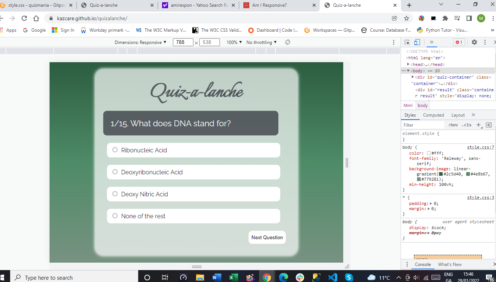
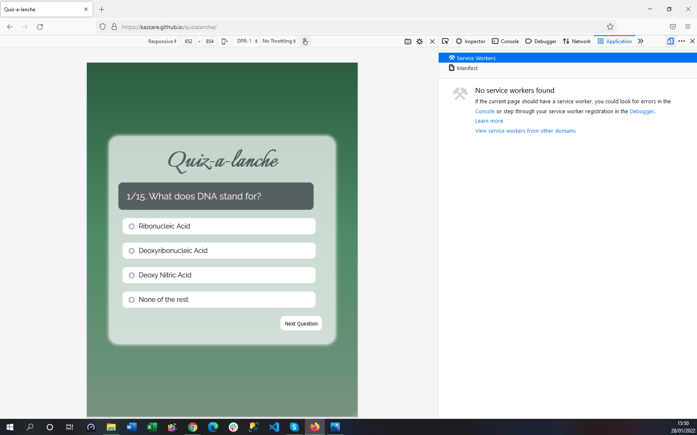
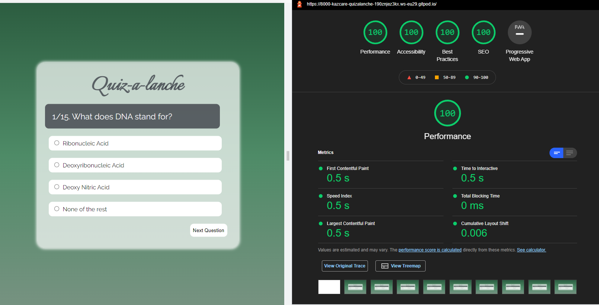

# **Quiz-a-lanche**
## Overview

This is a *science quiz* game, which is very **easy to use**. I does not have too many buttons which makes it easy to use for even an novice.

It currently has 15 questions to answer . Questions are related to different fields of science. Every question loads with a sequence number over the total mumber of questions, so the user will monitor the progress. Every question has 4 possible answers to choose from. It gives warning to user if the selection is not made and gives a feedback after every answer. It lets user know their achieved score out of the maximum achivable score at the end of the quiz.

The oroginal look was planned according to the following wireframes.

**GitHub repository** can be found by clicking <a href="https://github.com/kazcare/quizalanche" target="_blank" rel="noopener">**here**.</a> and the deployed **live link** for the website can be found by clicking <a href="https://kazcare.github.io/quizalanche/index.html" target="_blank" rel="noopener">**here**.</a>    

Following is the actual look after deployment.

## Table of contents 
* [Quiz-a-lanche](#quiz-a-lanche)
    * [User Goals](#user-goals)
    * [User Stories](#user-stories)
    * [Design Choices](#design-choices)
        * [Fonts](#fonts)
        * [Icons](#icons)
        * [Colors](#colors)
* [Features](#features)
    * [Current Features](#current-features)
        * [Quiz Container](#quiz-container)
    * [Future Heatures](#future-features)
* [Technologies Used](#technologies-used)
    * [Languages](#languages)
    * [Tools](#tools)
* [Testing](#testing)
    * [Physical Testing](#physical-testing)
    * [Validator Testing](#validator-testing)
    * [Fixed Bugs](#fixed-bugs)
* [Deployment](#deployment)
* [Credits](#credits)
    * [Content](#content)
    * [Media](#media)

## User Goals

* Website Application should be easy to navigate on all different screen formats such as desktop, tablets and mobile phones.
* It should be visually pleasing.
* It should have useful informative challenging questions.
* Easy to follow, self explainatory application.

[Back to Top](#table-of-contents)

## User Stories

* As returning user I prefer that the quiz should not have too many unnecessary buttons.
* I would like to see my progress throughout the quiz.
* It should warn user if the answer is not selected.
* It should be giving user feedback about their knowledge.
* I would like to see some interesting, informative and challenging questions in the quiz game.
* It should look professionally designed.

[Back to Top](#table-of-contents)

## Design Choices

### Fonts

I have used Google fonts to find the desired font styles for this project and have decided to use font **'Italianno' and 'Raleway'**. These are the kind of fonts I wanted to add to this particular project.

* I used Italianno font style for the heading. Italianno give it a funky touch. 

* For the rest body area I used Raleway font. It makes the app very easy to read.

### Icons

I have used one icon for the window title, which I googled and downloaded and then got it converted as icon file from the **[Favicon website](https://favicon.io/ "Favicon website")**.

### Colors

It has a linear gradient effect to it's background, which shifts between green and gray from top to bottom. 
I picked **white** *rgba(255, 255, 255, 0.7)* for the main quiz container.
I used a colour similar to **dark gray** *rgba(13, 13, 26, 0.6)* for the heading and question container and container has a white shadow aroud the container. 
Option containers and the Next Question button has **white** rgba(255, 255, 255, 1.0) background color and **black** text color.

[Back to Top](#table-of-contents)

## Features
### **Current Features**
#### **Quiz Container**
 
 * Heading is including in the actual Quiz container.

 * It has a funky looking heading with 'Italianno' font.

 * It has linear gradient feature used for the body's background colour. It amalgamate **green and gray** colours.
 
 * Color palette I used is green and gray with mild opacity to make it look more apealing.

 * Quiz container is always stays in the middle of the screen for all the screen sizes.

 * Quiz containers holds a Question Container, 4 Option Containers  (radio buttons as there is only one possible answer to each question) and a Next Question Button.

 * Question container has a darker background color with light text color.

 * While Option Containers and Next Question Button have lighter background color with dark text color. These Option Containers and Next Question Button have Hover feature added to them, so they temporarily change their background color to the same color as Question Container when the mouse pointer hovers over them.

 * All functions on the Quiz Container is controlled by Next Question Button.

 * Quiz game loads with the first question on the screeen and it lets user know about their progress throughout the quiz.

 * If the Next Question Button clicked without making a selection, a message appears at the bottom of the quiz container "Please, select your answer"

 * When an option is selected and Next Qestion Button is pressed, the selcted option is checked against the correct answer provided in "question.js" and Quiz container disappears and a message box appears with either green or red background colour, showing whether user has picked the correct answer or not. Plus it has a Continue button at the bottom right corner to continue to the rest of the quiz.

 
 

 * When continue button is clicked the next question loads and selected option radio button unchecks again and user can make selction for the next question.

 * This process repeats until the last avaiable question displays. As soon as the last question pops on screen the Next Question Button changes it's text to **Finish**.

 * After making the selection for the last question user clicks the Finish button and the Quiz container disappears and result container appears with the achieved score versus maximum achievable score.

 

 * If the user wants to play quiz again the page can be refreshed to start the quiz again.

### **Future Features**

 * In the future it will have different catagories of quiz to attract more users

 * It will have randomly generated questions

[Back to Top](#table-of-contents)

## Technologies Used
### Languages

I used only HTML5, CSS3 and JavaScript languages throughout the project.
I used media query to make the website responsive to different screen sizes.

### Tools

I used Gitpod IDE to code my project. 

* Following procedures are to be followed to get to the Gitpod IDE.

    1. Firstly you need to login to your GitHub account.

    2. Create a new repository by clicking green "New" button on the right hand side.

    3. Once the repository is created, click the repository to open it.

    4. Once it is opened, click the green "Gitpod" button on the right hand side to create a Gitpod workspace. It takes some time to create it.
        
* Note: Once the Gitpod workspace is created for certain repository, do not click the green Gitpod button again, as it will create another workspace for the same repository. Everytime after the Gitpod workspace is created, access it by clicking <a href="https://gitpod.io/workspaces" target="_blank" rel="noopener">gitpod.io/workspaces</a>.

    5. In the Gitpod IDE there are three main sections: 
        - On the left hand side there is an explorer that shows the list of the files and folders in the project. 
        - The right hand side is divided into two portions vertically. 
        - Bigger portion on the top is for write codes and the bottom is to write commands for the Gitpod IDE.

    6. Every change made to the any file and folder in the project has to be sent to GitHub, otherwise the deployed project will not show those changes.

    7. To send the changes to GitHub following three steps to be followed:
        - First, changes are to be added by giving command 'git add filename' or use 'git add .' for adding all the changes to more than one item in the project. 
        - Once these changes are added, a commit command to be entered by giving command 'git commit -m "message regarding changes made since last commit" '. 
        - After the commit command 'git push' command is to be entered to push all the chages to the deployed project.

[Back to Top](#table-of-contents)

## **Testing**

### Physical Testing

* Testing was carried out on Google Chrome, Microsoft Edge and Mozilla Firefox for following devices:

    - Google Nexus 10

    - iPhone 13 Pro

    - iPad

    - iPad Pro

    - OnePlus 9

    - Huawei Mate 20 Pro

    - Samsung Galaxy Fold

    - Samsung Galaxy S20

    - Samsung Galaxy S21

    - Samsung Galaxy Tab S4

[Back to Top](#table-of-contents)

### **Testing Features**

* Following features were tested for all of the above screen sizes

    - Quiz Container and Result Container stay in the middle of the all screen sizes horizontally and vertically.

    - Quiz Container and the Option containers cover same amount of space horizomtally.

    - Quiz container disappears as user clicks Next Question button after selectin an answer and a message box appears. 
    
    - The message box shows up with either green or red background colour depending the selected answer.
    
    - The message box has a Continue button at the bottom right corner to continue to the rest of the quiz.

    - Next Question button stays at the right hand bottom corner of the Quiz container and changes it's text content to Finish as the last question displays on the screen.

    - As user clicks the Finish button the Quiz container disappears again and shows up the Result container with the achieved score.

**Google Chrome**

  
**Microsoft Edge**

 
**Mozilla Firefox**

    
[Back to Top](#table-of-contents)

## Validator Testing

### HTML
* No errors were detected by official W3C validator for html file.

### CSS
* No issues were indicated by official W3C CSS (Jigsaw) validator for css file.

### JavaScript
* No errors were found when passing through Jshint validator.
    - The following mertics were returned:
    - There are 5 functions in this file.
    - Function with the largest signature take 1 arguments, while the median is 0.
    - Largest function has 16 statements in it, while the median is 11.
    - The most complex function has a cyclomatic complexity value of 4 while the median is 1.

* I used the lighthouse option in the Google Chrome Dev Tools to verify the website integrity. Following is the screenshot of the report. 
    

[Back to Top](#table-of-contents)

## Fixed Bugs

* Originally the Quiz container was changing the backgoud colour to either green or red to show the user if the selected answer was correct ot not. But it was not changing it back to original state before the next question appears on the screen. 

* To solve it by creating a container to show the message whether the selected answer is correct or not with a Continue button to go back to Quiz. Plus this container shows up either with green or red background color, depending on the selected answer. This container replaces the Quiz Container after user clicks Next Question Button, it means the actual quiz stays as it is.

[Back to Top](#table-of-contents)

## Deployment

project was deployed through <a href="https://github.com/" target="_blank" rel="noopener">GitHub.com</a>.

1. It was done by logging in to GutHub account and clicked on "your repositories" link in the "my account" menu. 

2. Specific project repository to be clicked. it would opened another page with all files created for that project. 

3. On top of the screen just above the list of file there was a menu. 

4. Next, setting option to be clicked on the right hand of the menu, which opened up the setting page. 

5. GitHub Pages option to be found by scrolling down to almost to the bottom of the page. 

6. It said "Pages settings now has its own dedicated tab! Check it out here!"
 
7. "Check it out here" was a link, when it was clicked , it opened "GitHub pages".

8. Second heading said source and under source there was drop-down menu and it had "None". 

9. The drop down menu needed to opened to pick "main" and save button to be clicked. 

10. that was all and it was deployed.

[Back to Top](#table-of-contents)

  
## Credits

I would like to inform you all that this project (Quizalanche) is built for **educational purpose** only. I have rendered the following items and information from different resources. I would like to thank all of these resources for helping me completing my project.

### Content

All questions were takem from **"radiotimes.com"**

### Media

* Icon image I used for the browser window, was downloaded from google and converted into icon file using "favicon.com".

[Back to Top](#table-of-contents)
